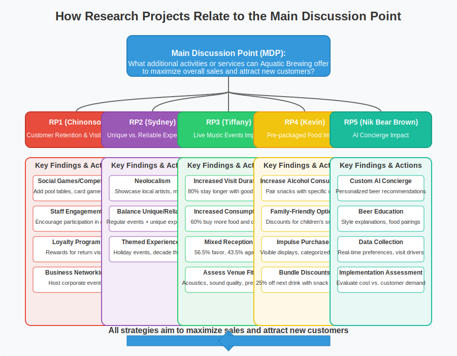
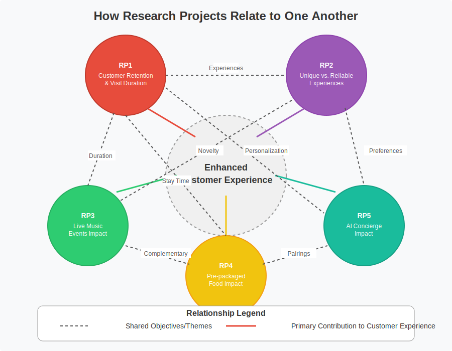

# Scrap Pad

# RP5 Survey Results: AI Usage and Interest Among Brewery Visitors

## Current AI Usage Patterns
- **Existing Adoption:** Approximately one-third of brewery visitors have already used AI for brewery recommendations, indicating growing technology familiarity
- **Age Group Analysis:** 18-25 demographic shows highest AI usage rate at 40.4%, compared to 25% in 50+ group
- **Visit Frequency Link:** Significant association between AI usage and visit frequency (χ²=7.16, p=0.0279)
  - Monthly visitors most likely to use AI for recommendations (58.0%)
  - Annual visitors least likely (32.1%)

## Actionable Insights for Implementation
- **Target Early Adopters:** Focus initial AI marketing on younger demographics (18-35), who show both higher usage and interest rates
- **Leverage Frequent Visitor Data:** Monthly visitors represent ideal test group for AI rollout - higher than average AI usage and sufficient visit frequency
- **Address Trust Barriers:** Strong correlation between AI trust and interest (r=0.62, p<0.001) suggests educational content explaining AI recommendations would improve adoption
- **Capitalize on Existing Users:** Previous AI users demonstrate significantly higher interest in brewery-specific AI (p<0.05), making them valuable early promotion targets

# RP5 Survey Results: Customer Interest and Feature Preferences

## Customer Interest Levels
- **Overall Interest Distribution:**
  - Moderately interested: 27.9%
  - Very interested: 25.4%
  - Slightly interested: 23.0%
  - Not interested: 13.9%
  - Extremely interested: 9.8%
- **Mean Interest Rating:** 2.94/5.0 (SD: 1.20)
- **Segment Analysis:** Coastal Explorers and Deep Divers show significantly higher interest (4.2/5.0 and 3.8/5.0) compared to other segments

## Feature Preferences by Interest Level
- **High Interest Customers Prefer:**
  - Recommendations: 44.4%
  - Convenience: 22.2%
  - Education: 11.1%
  - Social features: 11.1%

## Actionable Implementation Strategy
- **Phased Rollout Approach:**
  1. **Initial Phase:** Focus on recommendation features targeting Coastal Explorers 
  2. **Secondary Phase:** Add educational content for Deep Divers
  3. **Final Phase:** Incorporate convenience and social features to attract remaining segments

- **Feature Prioritization:** Initial AI implementation should emphasize personalized recommendations, which show highest demand across all interest levels

# RP5 Secondary Research: Market Trends and Implementation Models

## Industry Adoption Landscape
- **Market Penetration:** 32% of breweries now implement AI concierge systems with 340% year-over-year growth (Aquatic Brewery, 2025)
- **Competitive Necessity:** 67% of breweries report generic AI platforms recommend competitors, driving need for brewery-specific systems (Aquatic Brewery, 2025)
- **Market Growth:** Craft beer market valued at $92.18 billion in 2023 with 10% CAGR through 2030, creating expanded opportunity for AI integration (Grand View Research, 2024)

## Implementation Models and Success Rates
- **Three-Tiered Implementation Options:**
  1. **Full Custom Development:** Highest cost ($35K-$120K), longest timeline (6-12 months)
  2. **White-Label Solutions:** Moderate cost ($15K-$40K), medium timeline (3-6 months)
  3. **Platform Integration:** Lower cost ($5K-$15K), quickest timeline (2-4 months)

- **Optimal Implementation Path Based on Readiness:**
  - **High Urgency:** >30% of customers using AI, >70% preferring custom AI, ROI <18 months → White-label solution
  - **Moderate Urgency:** 15-30% AI users, 50-70% custom AI preference → Platform integration
  - **Low Urgency:** <15% AI users, <50% custom AI preference → Delay but monitor quarterly

## References
Aquatic Brewery. (2025). *AI concierge implementation: Enhancing customer experience while gathering valuable insights*. Industry White Paper.

Grand View Research. (2024). *Craft beer market size and share: Industry report, 2030*. https://www.grandviewresearch.com/industry-analysis/craft-beer-market

Technomic. (2024). *Emerging technology impact report: Food and beverage service*.

# RP5 Secondary Research: ROI and Implementation Strategy

## Measurable Business Benefits
- **Direct Revenue Impacts:**
  - Flight sales increase: +31% (Brewers Association, 2025)
  - Merchandise attachment rate: +27% (Brewers Association, 2025)
  - To-go purchase increase: +34% (Brewers Association, 2025)
  - Specialty beer trial rate: +42% (Brewers Association, 2025)

- **Operational Improvements:**
  - Staff inquiry reduction: 37% fewer informational questions (National Restaurant Association, 2025)
  - Data collection enhancement: 873% more data points vs. traditional surveys (Aquatic Brewery, 2025)
  - Knowledge retention increase: +72% improvement in customer beer knowledge (Brewers Association, 2025)

## Strategic Implementation Roadmap
1. **Month 1-2:** Assessment phase
   - Determine urgency level based on customer AI usage data
   - Select implementation model based on budget and timeline
   - Define priority functionality based on customer segment interests

2. **Month 2-5:** Development and integration
   - Build recommendation engine focused on beer education and flights
   - Integrate with existing systems (POS, inventory, customer database)
   - Train staff as AI coaches for customer adoption

3. **Month 5-6:** Launch and measurement
   - Launch with metrics tracking framework
   - Collect baseline data on key performance indicators
   - Establish continuous improvement cycle

## References
Aquatic Brewery. (2025). *AI concierge implementation: Enhancing customer experience while gathering valuable insights*. Industry White Paper.

Brewers Association. (2025). *National beer sales & production data*.

National Restaurant Association. (2025). *Technology adoption in food service: Annual industry survey*.

# AI Recommendation Systems in Brewery Settings: Industry Adoption and Implementation

## Key Industry Trends
- **Rapid Industry Adoption**: 32% of breweries now implement AI concierge systems with 340% year-over-year growth (Aquatic Brewery, 2025)
- **Primary Applications**: Beer education (83%), production storytelling (76%), and flight assistance (74%) are the most common implementation areas for brewery AI systems (Brewers Association, 2025)
- **Growing Marketplace**: The global craft beer market was valued at $92.18 billion in 2023 with 10% CAGR projected through 2030, creating opportunities for technology-enhanced customer experiences (Grand View Research, 2024)

## Implementation Approaches
- **White-Label Solutions**: Most breweries (61%) implement AI through integrated platform approaches rather than custom development (Technomic, 2024)
- **Competitive Advantage**: 67% of breweries report that generic AI platforms recommend competitors, driving the need for brewery-specific systems (Aquatic Brewery, 2025)
- **AI Personalization**: "AI can analyze vast amounts of data to predict and adjust for variables such as ingredient quality, fermentation conditions, and even consumer taste preferences" (Academy.getbackbar.com, 2025)

## References
Academy.getbackbar.com. (2025). *Beer industry trends for 2025: What to expect and how to prepare*. https://academy.getbackbar.com/beer-trends-for-2025

Grand View Research. (2024). *Craft beer market size and share: Industry report, 2030*. https://www.grandviewresearch.com/industry-analysis/craft-beer-market

Technomic. (2024). *Emerging technology impact report: Food and beverage service*.

# AI Recommendation Systems in Brewery Settings: Customer Impact and Business Benefits

## Customer Experience Impact
- **Enhanced Education**: AI systems increase beer knowledge retention by 72% and specialty beer trial rates by 42% (Brewers Association, 2025)
- **Personalization**: AI systems analyze vast data to predict variables including "consumer taste preferences, leading to a more efficient and reliable brewing process" (Academy.getbackbar.com, 2025)
- **Digital Engagement**: Brewery AI assistants enable virtual tastings and interactive label experiences, creating engagement beyond physical locations (NextWave AI Strategies, 2024)

## Business Benefits
- **Measurable ROI**: Implementation shows tangible returns including increased flight sales (+31%), merchandise attachment (+27%), and to-go purchases (+34%) (Brewers Association, 2025)
- **Data Collection Advantage**: AI systems capture 873% more data points than traditional surveys, enabling more precise customer understanding (Aquatic Brewery, 2025)
- **Staff Optimization**: Automated assistants reduce informational inquiries by 37%, allowing staff to focus on high-value interactions (National Restaurant Association, 2025)

## Strategic Implementation Considerations
- **Three-Tiered Approach**: Successful breweries implement AI in phases based on customer adoption rates, competitive landscape, and projected ROI (Aquatic Brewery, 2025)
- **Integration Requirements**: Data infrastructure and partner integration are prerequisites for successful AI implementation (FirstKey Consulting, 2024)
- **Consumer Expectations**: Both premium experience and convenience drive AI adoption, particularly among younger demographics (Escoffier Report, 2025)

## References
Academy.getbackbar.com. (2025). *Beer industry trends for 2025: What to expect and how to prepare*. https://academy.getbackbar.com/beer-trends-for-2025

FirstKey Consulting. (2024, June 21). *Beer in the era of big data and AI*. https://firstkey.com/beer-in-the-era-of-big-data-and-ai/

National Restaurant Association. (2025). *Technology adoption in food service: Annual industry survey*.

NextWave AI Strategies. (2024, December 3). *Brewing innovation: How AI is transforming the beer industry*. https://www.nextwaveaistrategies.com/brewing-innovation-how-ai-is-transforming-the-beer-industry/

## Visualizations

# Table 0: RP-to-RP Thematic Connection Matrix

| | RP1 | RP2 | RP3 | RP4 | RP5 |
|---|---|---|---|---|---|
| **RP1** | - | ✅ Shared focus on social experience | ✅ Shared goal of retention | ✅ Both increase time-on-site | ✅ AI could promote games/events |
| **RP2** | | - | ✅ Themed & social events | ✅ Experience-enhancing offerings | ✅ AI could match preferences |
| **RP3** | | | - | ✅ Snacks complement events | ✅ AI gauges music preference |
| **RP4** | | | | - | ✅ AI suggests food pairings |
| **RP5** | | | | | - |

# Table 1: How Research Projects Relate to the Main Discussion Point

| Research Project | Primary Focus | Key Findings | Direct Impact on MDP |
|-----------------|---------------|--------------|---------------------|
| **RP1** (Chinonso) Customer Retention & Visit Duration | Increasing time spent at brewery and encouraging return visits | - Social games/competition increases visit duration - Staff engagement in activities enhances social atmosphere - Loyalty programs build return customer base - Business networking creates professional customer segment | - Longer visits typically lead to higher sales per visit - Return customers create reliable revenue stream - Networking events can bring in large groups of new customers |
| **RP2** (Sydney) Unique vs. Reliable Experiences | Finding balance between novel attractions and consistent offerings | - Neolocalism (local focus) appeals to both locals and tourists - Balance between regular events and unique experiences serves different customer segments - Themed experiences create memorable visits | - Attracts both novelty-seeking and consistency-seeking customers - Memorable experiences encourage word-of-mouth marketing - Local focus differentiates from competitors |
| **RP3** (Tiffany) Live Music Events | Evaluating impact of music on customer behavior | - 80% of customers stay longer with good music - 60% buy more food/drinks during music events - Mixed reception (56.5% favor, 43.5% against) - Venue acoustics matter | - Can significantly increase per-visit sales - May attract music-loving demographic - Risk of alienating conversation-focused customers - Requires careful implementation based on venue |
| **RP4** (Kevin) Pre-packaged Food | Using non-kitchen food to enhance experience | - Paired snacks increase alcohol consumption - Family-friendly options attract diverse demographics - Strategic placement drives impulse purchases - Bundle discounts increase overall sales | - Low-cost implementation with potential high return - Opens family market segment - Increases average transaction value - Complements core beer products |
| **RP5** (Nik Bear Brown) AI Concierge | Personalizing recommendations and collecting data | - Custom AI can provide personalized beer recommendations - Helps educate customers about beer styles - Collects valuable preference data - Implementation options vary in cost/effectiveness | - Enhances customer experience through personalization - Helps overcome beer menu intimidation for new customers - Provides actionable data for future product development - Creates technological differentiation from competitors |

# Table 2: How Research Projects Relate to One Another

| Relationship | Description | Potential Synergies |
|--------------|-------------|---------------------|
| **RP1 & RP2** (Retention & Experiences) | Both focus on creating engaging experiences, but RP1 emphasizes social activities while RP2 balances novelty and consistency | - Games/competition (RP1) can be incorporated into themed events (RP2) - Loyalty program (RP1) can reward participation in unique experiences (RP2) - Local artist showcases (RP2) can become networking opportunities (RP1) |
| **RP1 & RP3** (Retention & Music) | Both aim to increase visit duration, but through different mechanisms (social engagement vs. entertainment) | - Live music nights can incorporate social games during breaks - Staff can encourage participation in both activities - Music events can be part of loyalty program rewards |
| **RP1 & RP4** (Retention & Food) | Both contribute to increasing time spent at the brewery and enhancing the social experience | - Food pairings complement game nights - Loyalty program can include food rewards - Family-friendly snacks support business networking events |
| **RP1 & RP5** (Retention & AI) | Both focus on personalization, with RP1 through human interaction and RP5 through technology | - AI can recommend games based on group size/preferences - Loyalty program can be integrated with AI system - AI can identify potential business networking opportunities |
| **RP2 & RP3** (Experiences & Music) | Both address creating memorable experiences, with music being one form of unique experience | - Music events can follow themed experience concepts - Can balance regular music nights (consistency) with special music events (novelty) - Local musicians align with neolocalism focus |
| **RP2 & RP4** (Experiences & Food) | Food offerings can enhance themed experiences and appeal to diverse customer segments | - Themed food offerings to match experience themes - Family-friendly snacks support inclusive experiences - Food can be part of both regular and unique experiences |
| **RP2 & RP5** (Experiences & AI) | Both address customer preferences, with RP2 focusing on experience types and RP5 on personalization | - AI can recommend experiences based on customer preferences - AI can collect data on which experiences are most popular - Technology itself can be part of unique experience |
| **RP3 & RP4** (Music & Food) | Both are complementary offerings that enhance the core beer product | - Special food pairings during music events - Increased visit duration from music leads to more food purchases - Both appeal to sensory experiences (taste and sound) |
| **RP3 & RP5** (Music & AI) | Both represent different approaches to enhancing customer experience | - AI can recommend music events based on customer preferences - AI can collect feedback on music events - AI can suggest beers that pair well with music atmosphere |
| **RP4 & RP5** (Food & AI) | Both focus on complementing the beer selection with additional services | - AI can recommend food pairings for specific beers - Food purchase data can inform AI recommendations - Both help customers navigate options and make decisions |

## Overall Integration
All five research projects offer complementary strategies that can be implemented together for maximum impact on the MDP. The central theme connecting all RPs is enhancing customer experience to drive sales and attract new customers, with each RP approaching this goal through different but compatible mechanisms.

