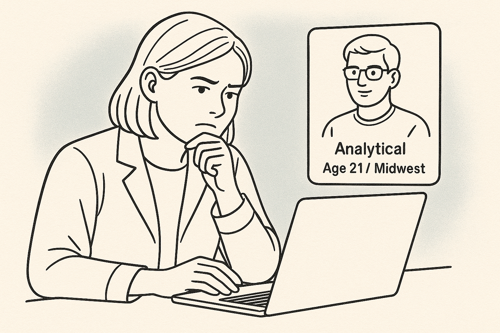
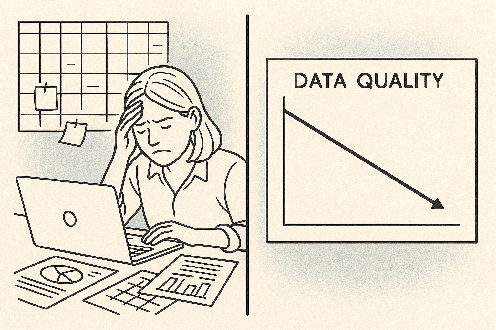
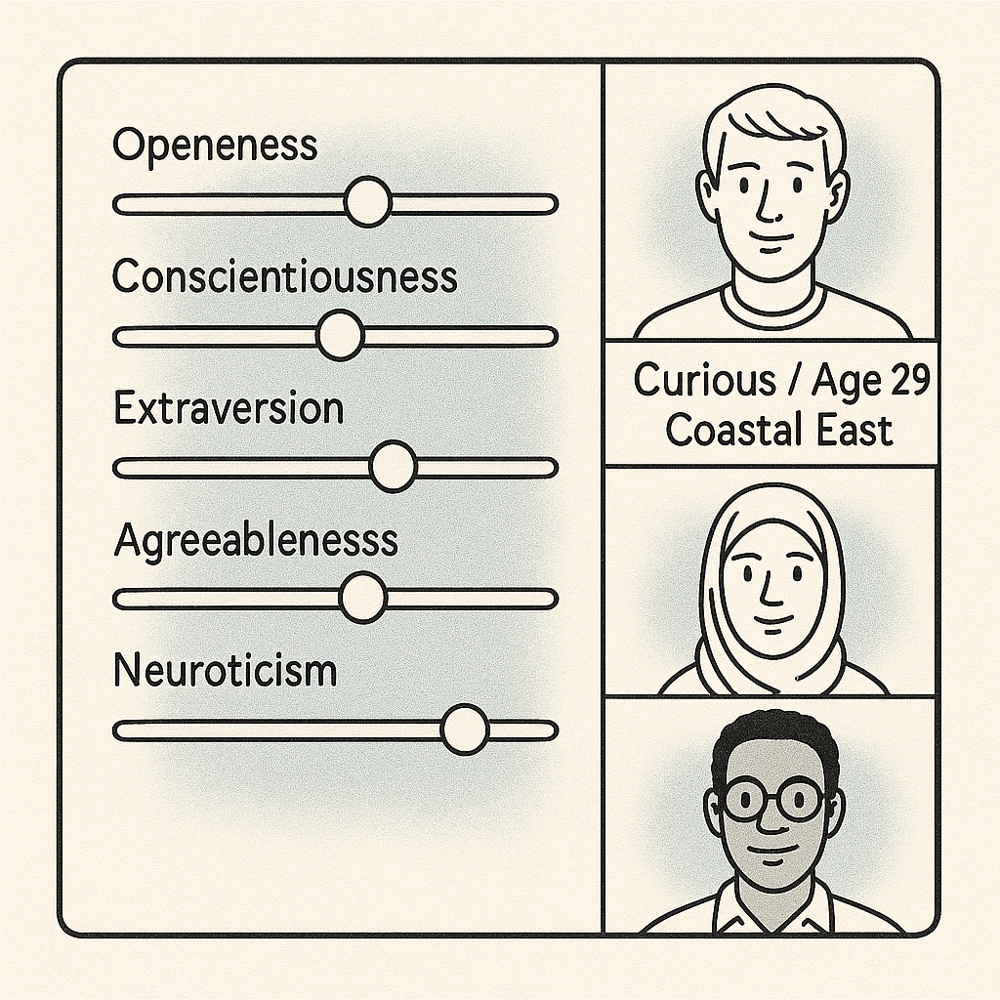
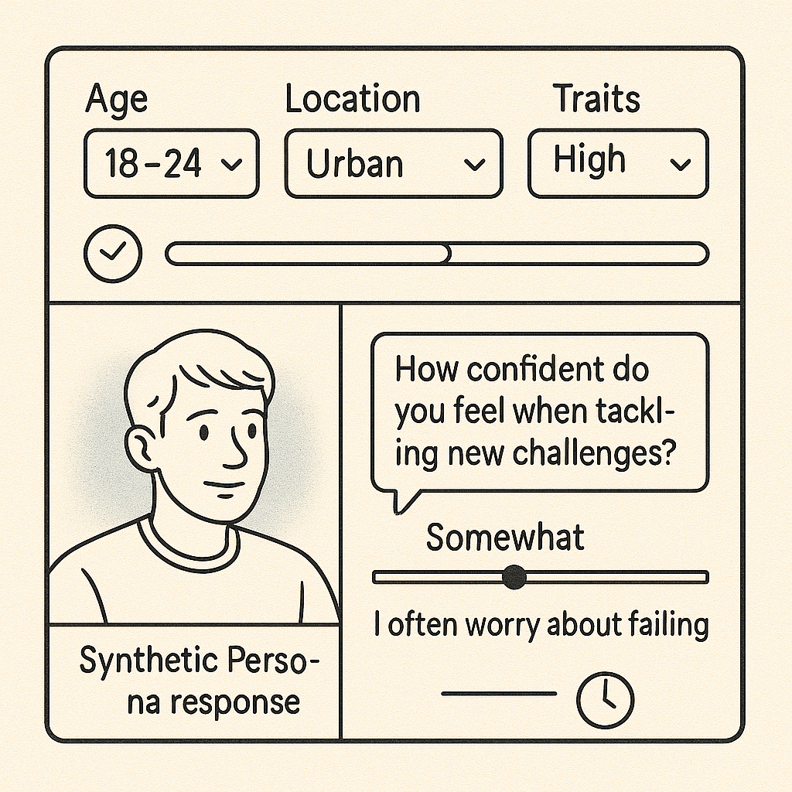
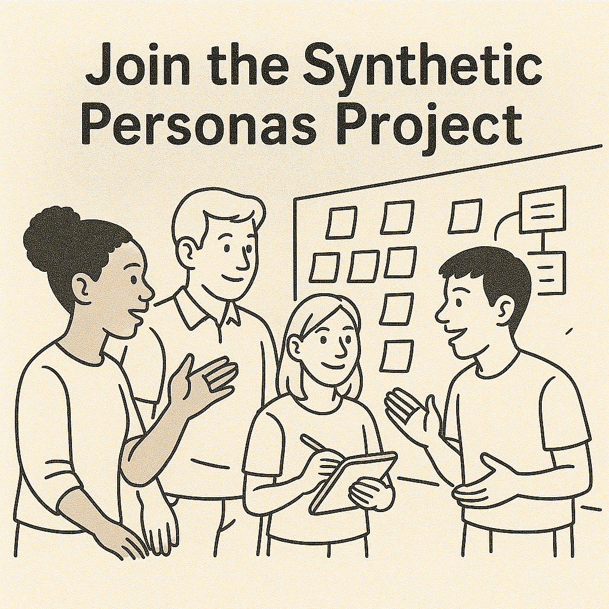

Storyboard Script: Synthetic Personas Recruitment Video
| Timecode   | Narrator                                                                                                                                      | Visual                         | Notes                                                                                         |
|------------|-----------------------------------------------------------------------------------------------------------------------------------------------|--------------------------------|-----------------------------------------------------------------------------------------------|
| 0:00–0:07  | "What if you could test your survey questions — instantly — with feedback shaped by real personality traits and demographics?"              |        | Hook the viewer quickly with a relatable problem and magical-feeling solution.               |
| 0:07–0:15  | "Right now, testing survey questions takes time, money, and human participants. But skipping testing means poor data and bad decisions."     |        | Emphasize the pain of current methods.                                                       |
| 0:15–0:27  | "We’re building tools that use AI-generated synthetic personas — based on real psychological models like the Big Five — to simulate how diverse people might respond. These systems are remarkably accurate at surfacing issues with question clarity, bias, and engagement." |  | Introduce the solution clearly and build confidence in its reliability.                     |
| 0:27–0:42  | "These personas let researchers catch weak questions early. They’ll be able to target profiles by age, location, or personality — and get instant, realistic feedback." |            | Show real UX-style interaction.                                                              |
| 0:42–0:55  | "The vision? A future where AI augments research, letting us build better surveys, products, and services — faster and more ethically."      |    | Inspire with a sense of purpose and scale. Leave the viewer feeling motivated to join.       |
| 0:55–1:05  | "If you’re a student passionate about AI, behavioral science, UX, or design — we’d love your help."                                           |        |                                                                                               |

**Voiceover**

"What if you could test your survey questions — instantly — with feedback shaped by real personality traits and demographics?"

"Right now, testing survey questions takes time, money, and human participants. But skipping testing means poor data and bad decisions."

"We're building tools that use AI generated synthetic personas — based on real psychological models like the Big Five — to simulate how diverse people might respond. These systems are remarkably accurate at surfacing issues with question clarity, bias, and engagement."

"These personas let researchers catch weak questions early. They are able to target profiles by age, location, or personality — and get instant, realistic feedback."

"The vision? A future where AI augments research, letting us build better surveys, products, and services — faster and more ethically."

"If you're a student passionate about AI, behavioral science, UX, or design — we'd love your help."

Please reach out to HR at humanitarians AI if interested.   
